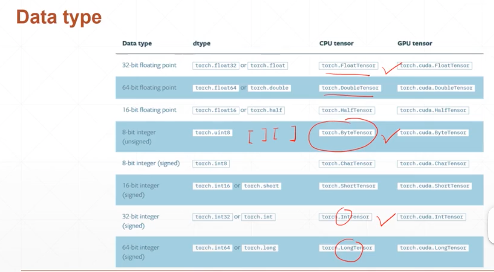

# pytorch
## 数据类型

    a = torch.randn(2,3)
    a.type === 'torch.FloatTensor'
    type(a) === torch.Tensor
    isinstance(a, torch.FloatTensor) === true
标量

    a = torch.tensor(1.)
    b = torch.tensor(1.3)
向量

    torch.tensor([1.1])
    torch.FloatTensor(1)
    torch.FloatTensor(2)
    data = np.ones(2)
    torch.from_numpy(data)
    torch.randn(2,3)
    torch.rand(1,2,3)  ## rnn
    torch.rand(2,3,28,28)  ## cnn
    a.numel()   ##tensor含有的元素个数
    a.dim() ##tensor的维度
## 创建tensor
1. from_numpy

    a=np.array([2,3,3])
    torch.from_numpy(a)
    torch.tensor([2,3.2])
    torch.FloatTensor([])
    torch.FloatTensor(2,3)
    Torch.empty(2,3)
    torch.rand(3,3)
    torch.rand_like(tensor_a)
    torch.randint(1,10,[3,3])
    torch.randn(3,3)
    torch.full([2,3],7)
    torch.full([],7)
    torch.arange(0,10)
    torch.arange(0,10,2)
    torch.linespace(0,10,steps=4)  # steps:数量
    torch.logspace(0,-1,setps = 10) # 返回10^x
    torch.ones(3,3)
    torch.zeros(3,3)
    torch.eye(3,4)
    torch.ones_like(tensor_a)
    torch.randperm(10) # tensor([1,3,4,2,5,9,0,9,8,7]) 用于shuffle  两个tensor进行索引shuffle匹配

## 索引切片

    a = torch.rand(4,3,28,,28) # dim 0 first
    a[:2] # 2*3*28*28
    a[:2,:1,:,:] # 2*1*28*28
    a[:2,1:,:,:] # 2*2*28*28
    a[:2,-1:,:,:] # 2*1*28*28
    
    ## select by steps
    a[:,:,0:28:2,0:28:2] # 4,3,14,14
    a[:,:,::2,::2]  # 4*3*14*14
    a.index_select(0,tensor([0,2])) # 2*3*28*28  第二个参数必须是tensor
    a.index_select(1,tensor([1,2])) # 4*2*28*28
    a.index_select(2,torch.arange(8)) # 4*3*8*28
    a[...] # 4*3*28*28
    a[0,...] # 3*28*28
   
    ## select by mask 通过掩码
    x = torch.randn(3,4)
    mask = x.ge(0.5)
    torch.masked_select(x,mask)
    ## select by flatten index
    src = torch.tensor([[4,3,5],[6,7,8]])
    torch.take(src,torch.tensor([0,2,5]))

   

    
    
    